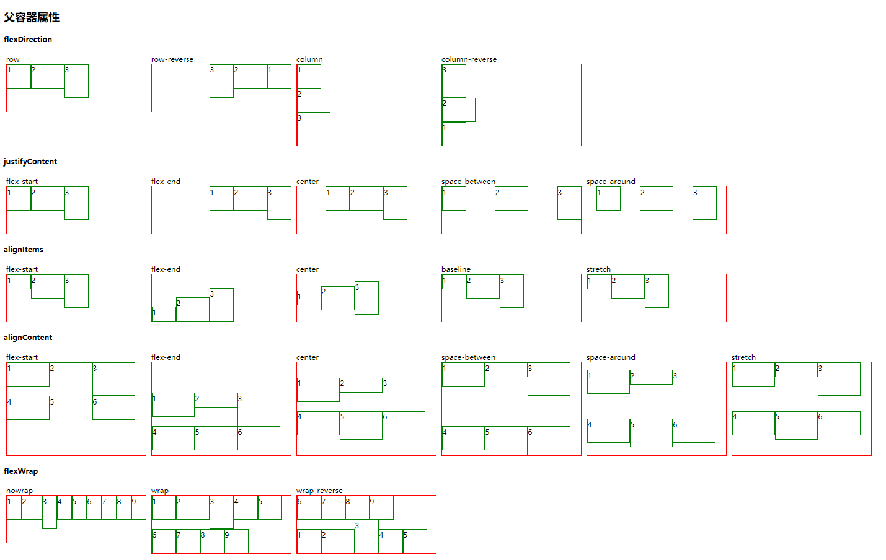
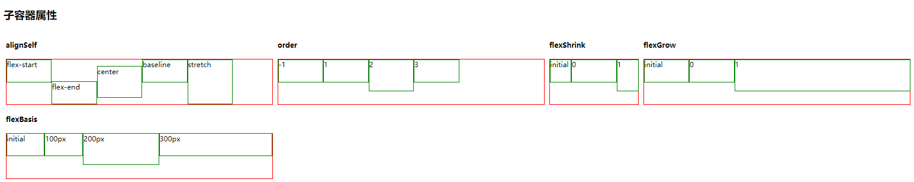

[TOC]

## 原理图




## 属性

| Properties 属性                                              | CSS Version 版本 | Inherit From Parent 继承性 | Description 简介                                           |
| :----------------------------------------------------------- | :--------------- | :------------------------- | :--------------------------------------------------------- |
| [flex](http://lzw.me/pages/css3/properties/flex/flex.htm)    | CSS3             | 无                         | 复合属性。设置或检索伸缩盒对象的子元素如何分配空间。       |
| [flex-grow](http://lzw.me/pages/css3/properties/flex/flex-grow.htm) | CSS3             | 无                         | 设置或检索弹性盒的扩展比率。                               |
| [flex-shrink](http://lzw.me/pages/css3/properties/flex/flex-shrink.htm) | CSS3             | 无                         | 设置或检索弹性盒的收缩比率                                 |
| [flex-basis](http://lzw.me/pages/css3/properties/flex/flex-basis.htm) | CSS3             | 无                         | 设置或检索弹性盒伸缩基准值。                               |
| [flex-flow](http://lzw.me/pages/css3/properties/flex/flex-flow.htm) | CSS3             | 无                         | 复合属性。设置或检索伸缩盒对象的子元素排列方式。           |
| [flex-direction](http://lzw.me/pages/css3/properties/flex/flex-direction.htm) | CSS3             | 无                         | 设置或检索伸缩盒对象的子元素在父容器中的位置。             |
| [flex-wrap](http://lzw.me/pages/css3/properties/flex/flex-wrap.htm) | CSS3             | 无                         | 设置或检索伸缩盒对象的子元素超出父容器时是否换行。         |
| [align-content](http://lzw.me/pages/css3/properties/flex/align-content.htm) | CSS3             | 无                         | 设置或检索弹性盒堆叠伸缩行的对齐方式。                     |
| [align-items](http://lzw.me/pages/css3/properties/flex/align-items.htm) | CSS3             | 无                         | 设置或检索弹性盒子元素在侧轴（纵轴）方向上的对齐方式。     |
| [align-self](http://lzw.me/pages/css3/properties/flex/align-self.htm) | CSS3             | 无                         | 设置或检索弹性盒子元素自身在侧轴（纵轴）方向上的对齐方式。 |
| [justify-content](http://lzw.me/pages/css3/properties/flex/justify-content.htm) | CSS3             | 无                         | 设置或检索弹性盒子元素在主轴（横轴）方向上的对齐方式。     |
| [order](http://lzw.me/pages/css3/properties/flex/order.htm)  | CSS3             | 无                         | 设置或检索伸缩盒对象的子元素出現的順序。                   |

```
flex:1;
flex-grow:1;
flex-shark:1;
flex:basis:0;
```


## flex居中

```
.center{
    display: flex;
    align-items: center;  //垂直居中
    justify-content: center; //水平居中
}
```

## 自适应

一行三列，左右宽度固定，中间自适应

```
.container{
	display:flex;
	.left,right{
	  width:100px;
	}
	.middle{
	  flex:1
	}
}
```

