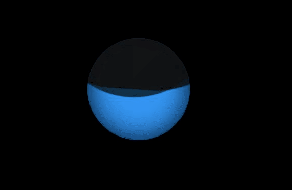

## 液体



```html
<!DOCTYPE html>
<html lang="en">
<head>
  <meta charset="UTF-8" />
  <meta name="viewport" content="width=device-width, initial-scale=1.0" />
  <title>液体流动</title>
</head>
<body>
<div class="loader"></div>

<style>
  * {
    margin: 0;
    padding: 0;
    box-sizing: border-box;
  }
  body {
    display: flex;
    align-items: center;
    justify-content: center;
    min-height: 100vh;
    background: #000;
  }
  .loader {
    position: relative;
    width: 200px;
    height: 200px;
    background: #2196f3;
    border-radius: 50%;
    box-shadow: inset 0 0 50px #000;
    overflow: hidden;
  }
  .loader::before{
    content:'';
    position:absolute;
    top:-150%;
    left:-50%;
    width:200%;
    height: 200%;
    border-radius: 40%;
    background: #111;
    opacity: 0.8;
    animation: animate 12s linear infinite;
  }
  @keyframes animate {
    0%{
      transform:rotate(0deg)
    }
    100%{
      transform:rotate(360deg)
    }
  }

  .loader::after{
    content:'';
    position:absolute;
    top:-150%;
    left:-50%;
    width:200%;
    height: 200%;
    border-radius: 40%;
    background: #111;
    opacity: 0.9;
    animation: animate2 5s linear infinite;
  }
  @keyframes animate2 {
    0%{
      transform:rotate(0deg)
    }
    100%{
      transform:rotate(360deg)
    }
  }
</style>
</body>
</html>
```

