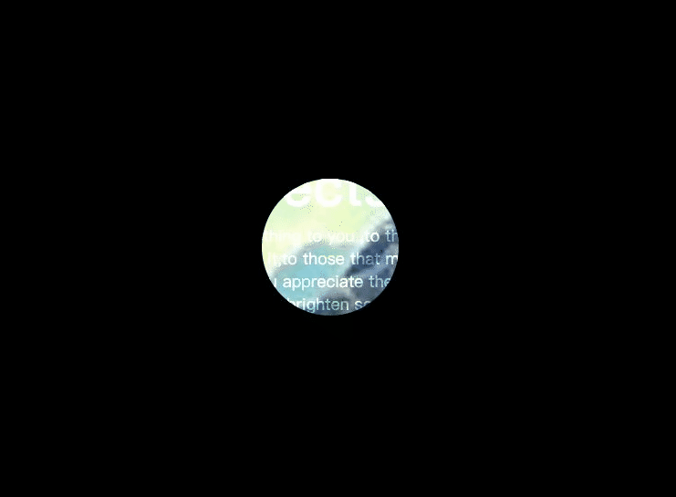

## 放大镜



```html
<!DOCTYPE html>
<html lang="en">
<head>
  <meta charset="UTF-8"/>
  <meta name="viewport" content="width=device-width, initial-scale=1.0"/>
  <title>放大镜</title>
</head>
<body>

<div class="banner">

</div>
<div class="content">
  <h2>CSS Clip-path Effects</h2>
  <p>
    Please send this message to those people who mean something to you ,to those who have touched
    your life in one way or another,to those who make you smile when you really need it,to those
    that make you see the brighter side of things when you are really down,to those who you want to
    let them know that you appreciate their friendship.And if you don't,don't worry,nothing bad
    will happen to you,you will just miss out on the opportunity to brighten someone's day with the
    message.Please send this message to those people who mean something to you,to those who have
    touched your life in one way or another.
  </p>
</div>
<style>
  * {
    margin: 0;
    padding: 0;
  }

  body {
    display: flex;
    align-items: center;
    justify-content: center;
    min-height: 100vh;
    background: #000;
  }

  .banner {
    position: fixed;
    width: 100%;
    height: 100vh;
    background: url("https://tse2-mm.cn.bing.net/th/id/OIP.oGjZ9HDV3jr9IKjUZcu6GAHaEo?w=288&h=180&c=7&o=5&pid=1.7");
    background-size: cover;
    display: flex;
    align-items: center;
    justify-content: center;
    /*transition: 0.2s;*/
    clip-path: circle(75px at var(--x) var(--y));
  }
  .banner:active{
    clip-path: circle(200px at var(--x) var(--y));
  }

  .content {
    position: relative;
    max-width: 1100px;
    z-index: 1;
    mix-blend-mode: overlay;
    pointer-events: none;
    user-select: none;
  }

  .content h2 {
    position: relative;
    color: #fff;
    font-size: 60px;
  }

  .content p {
    position: relative;
    color: #fff;
    font-size: 18px;
  }
</style>
<script>
  let pos = document.documentElement;
  pos.addEventListener('mousemove', e => {
    pos.style.setProperty('--x', e.clientX + 'px');
    pos.style.setProperty('--y', e.clientY + 'px');
  })
</script>
</body>
</html>
```

