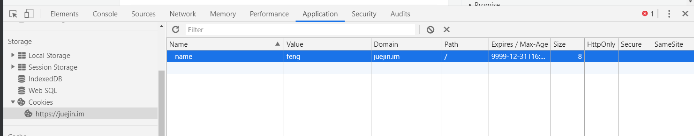
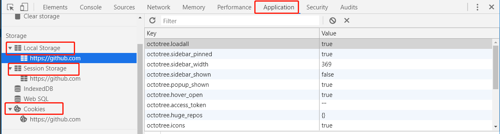

[TOC]
## cookie字段


### js操作cookie
```js
//添加cookie
document.cookie="name=feng"
//修改cookie
 document.cookie="name=feng1"
//删除cookie
//通过expires和max-age来删除
```
### 浏览器开发者工具操作cookie


### 服务器操作cookie
服务器添加 设置头 set-cookie sessionId=123
```java
import javax.servlet.http.Cookie;
import javax.servlet.http.HttpServletResponse;
/**
 * Cookie工具类
 */
public class CookieUtil {

    /**
     * 设置HttpOnly Cookie
     * @param response HTTP响应
     * @param cookie Cookie对象
     * @param isHTTPOnly 是否为HttpOnly
     */
    public static void addCookie(HttpServletResponse response, Cookie cookie, boolean isHttpOnly) {
        String name = cookie.getName();//Cookie名称
        String value = cookie.getValue();//Cookie值
        int maxAge = cookie.getMaxAge();//最大生存时间(毫秒,0代表删除,-1代表与浏览器会话一致)
        String path = cookie.getPath();//路径
        String domain = cookie.getDomain();//域
        boolean isSecure = cookie.getSecure();//是否为安全协议信息

        StringBuilder buffer = new StringBuilder();

        buffer.append(name).append("=").append(value).append(";");

        if (maxAge == 0) {
            buffer.append("Expires=Thu Jan 01 08:00:00 CST 1970;");
        } else if (maxAge > 0) {
            buffer.append("Max-Age=").append(maxAge).append(";");
        }

        if (domain != null) {
            buffer.append("domain=").append(domain).append(";");
        }

        if (path != null) {
            buffer.append("path=").append(path).append(";");
        }

        if (isSecure) {
            buffer.append("secure;");
        }

        if (isHttpOnly) {
            buffer.append("HTTPOnly;");
        }

        response.addHeader("Set-Cookie", buffer.toString());
    }

}

```

## storage
```typescript
interface Storage {
    /**
     * Returns the number of key/value pairs currently present in the list associated with the object.
     */
    readonly length: number;
    /**
     * Empties the list associated with the object of all key/value pairs, if there are any.
     */
    clear(): void;
    /**
     * Returns the current value associated with the given key, or null if the given key does not exist in the list associated with the object.
     */
    getItem(key: string): string | null;
    /**
     * Returns the name of the nth key in the list, or null if n is greater than or equal to the number of key/value pairs in the object.
     */
    key(index: number): string | null;
    /**
     * Removes the key/value pair with the given key from the list associated with the object, if a key/value pair with the given key exists.
     */
    removeItem(key: string): void;
    /**
     * Sets the value of the pair identified by key to value, creating a new key/value pair if none existed for key previously.
     *
     * Throws a "QuotaExceededError" DOMException exception if the new value couldn't be set. (Setting could fail if, e.g., the user has disabled storage for the site, or if the quota has been exceeded.)
     */
    setItem(key: string, value: string): void;
    [name: string]: any;
}

declare var sessionStorage: Storage;
declare var localStorage: Storage;
```



### sessionStorage
sessionStorage是Storage类型,生命周期跟tab页绑定


### localStorage
sessionStorage是Storage类型，不清除永远存在
### 比较

| 特性            | cookie| localStorage  | sessionStorage  |indexDB|
| :-------------- | :--------------- | :------------ | :------------ |:------------ |
| 数据生命周期   | 一般由服务器生成，可以设置过期时间  |除非被清理，否则一直存在 |domain/path匹配不到tab页时清除 |除非被清理，否则一直存在|
| 数据存储大小   | 4K  |5M |5M |无限|
| 与服务端通信   | 每次都会携带在 header 中，对于请求性能影响  |不参与 |不参与 |不参与|
