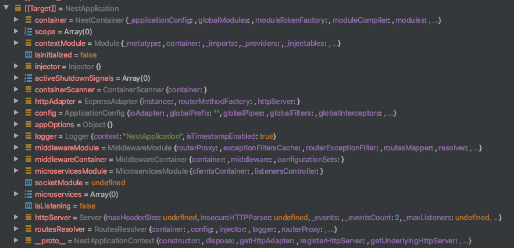
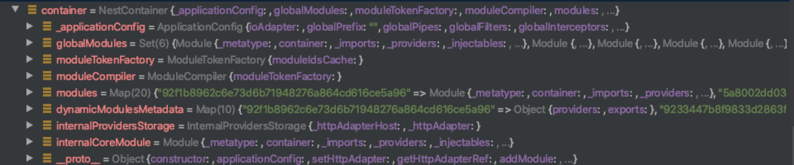
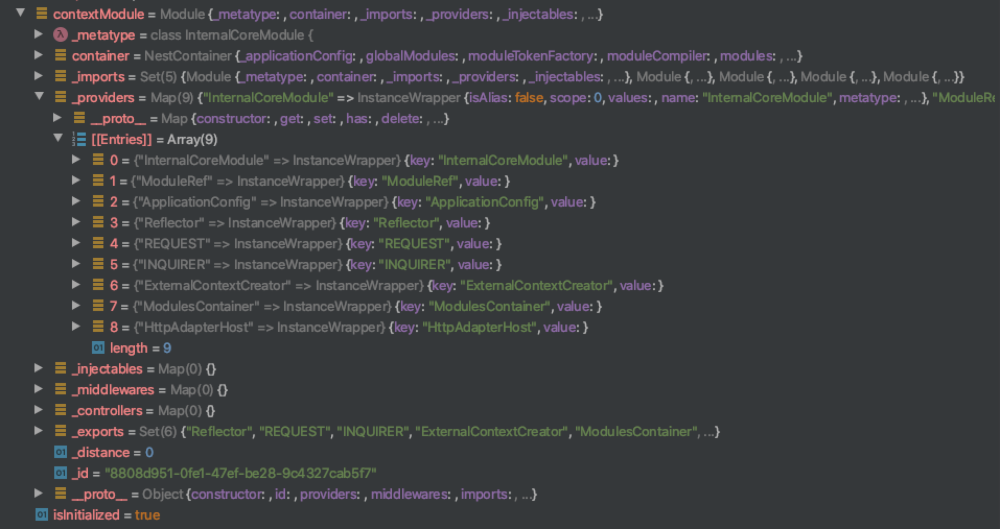
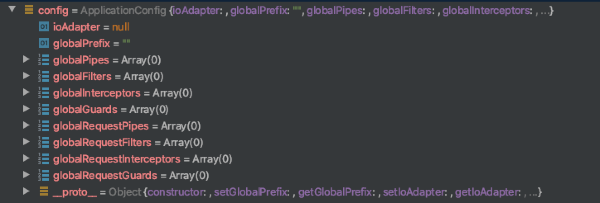

[TOC]


## NestApplication应用程序



## NestContainer容器



## contextModule上下文模块



上下文模块，默认提供9个providers

- InternalCoreModule

- ModuleRef

- ApplicationConfig

- Reflector

- REQUEST

- INQUIRER

- ExternalContextCreator

- ModulesContainer

- HttpAdapterHost

```typescript
@Controller('v3')
export class GoodsController {

  constructor(
    private goodsService: GoodsService,

    @Inject('InternalCoreModule') private internalCoreModule,
    private moduleRef: ModuleRef,
    private applicationConfig: ApplicationConfig,
    private reflector: Reflector,
    @Inject('REQUEST') private req,
    // @Inject('INQUIRER') private inq,
    private creator: ExternalContextCreator,
    private container: ModulesContainer,
    private adapterHost: HttpAdapterHost,

  ) {
  }
} 
```

## ApplicationConfig配置



