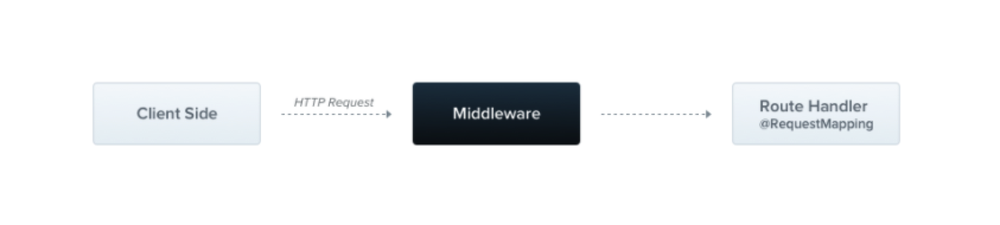
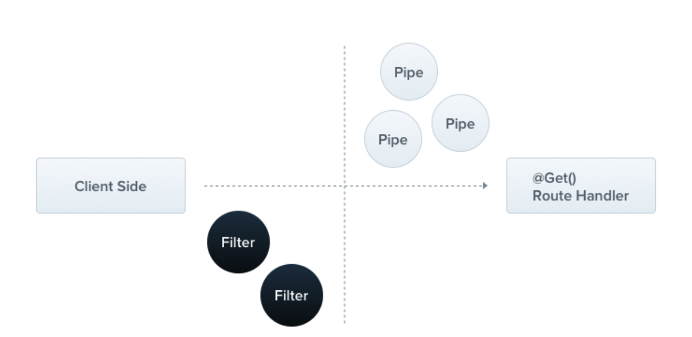
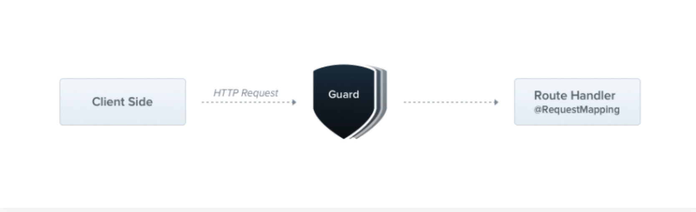
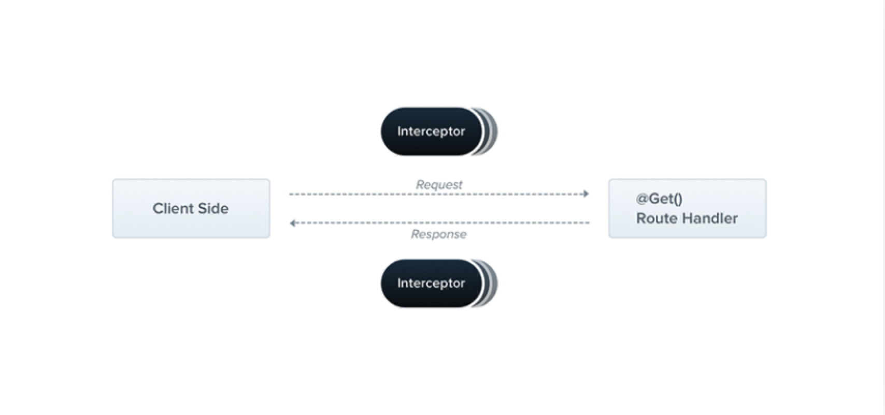
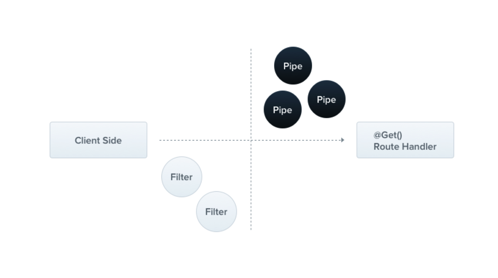

[TOC]
## Middleware中间件



- 在请求方法之前执行

```typescript
@Injectable()
export class LoggerMiddleware implements NestMiddleware {
  use(req: any, res: any, next: () => void) {
    console.log(`Request...`);
    next();
  }
}

import { Module, NestModule, MiddlewareConsumer } from '@nestjs/common';
import { LoggerMiddleware } from './common/middleware/logger.middleware';
import { CatsModule } from './cats/cats.module';

@Module({
  imports: [CatsModule],
})
export class AppModule implements NestModule {
  configure(consumer: MiddlewareConsumer) {
    //LoggerMiddleware 是内置的中间件
    consumer
      .apply(LoggerMiddleware)
      .forRoutes('cats');
  }
}
```

## filter



- 捕获程序执行过程中产生的异常

```typescript
import { ExceptionFilter, Catch, ArgumentsHost, HttpException } from '@nestjs/common';
import { Request, Response } from 'express';

@Catch(HttpException)
export class HttpExceptionFilter implements ExceptionFilter {
  catch(exception: HttpException, host: ArgumentsHost) {
    const ctx = host.switchToHttp();
    const response = ctx.getResponse<Response>();
    const request = ctx.getRequest<Request>();
    const status = exception.getStatus();

    response
      .status(status)
      .json({
        statusCode: status,
        timestamp: new Date().toISOString(),
        path: request.url,
      });
  }
}

@Controller()
export class UserController{
  @Get()
  async findAll() {
    throw new HttpException('Forbidden', HttpStatus.FORBIDDEN);
  }
}
```

## Guard守卫



- 和Middleware一样在请求方法执行前调用

- 主要用户做权限认证

```typescript
import { Injectable, CanActivate, ExecutionContext } from '@nestjs/common';
import { Observable } from 'rxjs';

@Injectable()
export class AuthGuard implements CanActivate {
  canActivate(
    context: ExecutionContext,
  ): boolean | Promise<boolean> | Observable<boolean> {
    const request = context.switchToHttp().getRequest();
    return validateRequest(request);
  }
}

@Controller('cats')
@UseGuards(RolesGuard)
export class CatsController {}
```

## Interceptor拦截器



- aop原理，在请求方法执行前后都会执行

```typescript
import { Injectable, NestInterceptor, ExecutionContext, CallHandler } from '@nestjs/common';
import { Observable } from 'rxjs';
import { tap } from 'rxjs/operators';

@Injectable()
export class LoggingInterceptor implements NestInterceptor {
  intercept(context: ExecutionContext, next: CallHandler): Observable<any> {
    console.log('Before...');

    const now = Date.now();
    return next
      .handle()
      .pipe(
        tap(() => console.log(`After... ${Date.now() - now}ms`)),
      );
  }
}

@Controller('cats')
@UseInterceptors(LoggingInterceptor)
export class CatsController {}
```

## Pipe管道



- 用于做数据校验，配合注解一起用

### 内置管道

- DefaultValuePipe
- ParseArrayPipe
- ParseBoolPipe
- ParseIntPipe
- ParseUUIDPipe
- ValidationPipe

```typescript
@Injectable()
export class ParseIntPipe implements PipeTransform<string> {
  async transform(value: string, metadata: ArgumentMetadata) {
    const val = parseInt(value, 10);
    if (isNaN(val)) {
      throw new BadRequestException('Validation failed');
    }
    return val;
  }
}

@Controller('cats')
export class CatsController {
  @Get(':id')
  async findOne(@Param('id', ParseIntPipe) id: number) {
    return this.catsService.findOne(id);
  }
}
```

##  使用核心组件

通过下面注解进行使用

- UserGuards

- UseInterceptors

- UsePipes

- UseFilters

三种使用方法
- 用在app上作用于所有Controller
- 用在Controllers上，作用于Contoller上的所有方法
- 用法方法上，只对该方法有效

```typescript
app.useGlobalInterceptors(new LoggingInterceptor())

@UseInterceptors(LoggingInterceptor)
export class CatsController {
  @Get(':id')
  @UseInterceptors(LoggingInterceptor)
  async findOne(@Param('id', ParseIntPipe) id: number) {
    return this.catsService.findOne(id);
  }

}
```

  ## 参考

[nest官方文档](https://docs.nestjs.com/interceptors)
[nest源代码](https://github.com/nestjs/nest/blob/master/packages/common/decorators/core/use-interceptors.decorator.ts)

