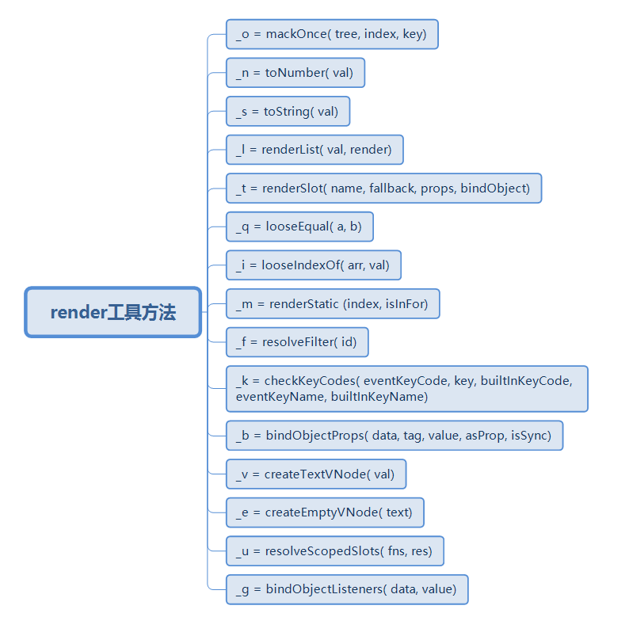

[TOC]

### vue中render方法

当vue option 中有template，此时需要vue compiler的库，将template模板通过编译，代码生成得到render方法。

vue中的 插值表达式、 v-if 、v-for、 v-modul 、sync、 v-html 、v-text都在这里体现。

```html
<div id="app">
    {{show}}
    <h1 v-if="show">render</h1>
    <ul>
        <li :key="i" v-for="i of 3">{{i}}</li>
    </ul>
    <comp-a v-model="show"></comp-a>
    <comp-a :value.sync="show"></comp-a>
</div>
<script src="../../node_modules/vue/dist/vue.js"></script>
<script>
    const compA = {
        template: '<div>1</div>'
    };
    let vm = new Vue({
        el: '#app',
        components: {
            compA
        },
        data() {
            return {
                show: true,
            }
        },
    })
</script>
```

生成的render方法为



```js
function createElement(
    // context,
    tag,
    data,
    children,
    // normalizationType,
    // alwaysNormalize
) {
}

function renderList(
    val,
    render
) {
}

function toString(val) {
    return val == null
        ? ''
        : Array.isArray(val) || (isPlainObject(val) && val.toString === _toString)
            ? JSON.stringify(val, null, 2)
            : String(val)
}

function createTextVNode(val) {
    return new VNode(undefined, undefined, undefined, String(val))
}

const _s = toString;
const _c = createElement;
const _l = renderList;
const _v = createTextVNode;

function render(_c) {
    with (this) {
        return _c('div', {attrs: {"id": "app"}}, [
       		 //插值表达式原理
            _v("\n    " + _s(show) + "\n    "),
             //v-if原理
            (show) ? _c('h1', [_v("render")]) : _e(), _v(" "),
            //v-for原理
            _c('ul', _l((3), function (i) {
                return _c('li', {key: i}, [_v(_s(i))])
            }), 0),
            _v(" "),
            _c('comp-a', {
            //v-modal原理
                model: {
                    value: (show), callback: function ($$v) {
                        show = $$v
                    }, expression: "show"
                }
            }),
            _v(" "),
            _c('comp-a', {
            //sync原理
                attrs: {"value": show}, on: {
                    "update:value": function ($event) {
                        show = $event
                    }
                }
            })
        ], 1)
    }
}

```

编译模板生成render方法，并挂载到option.render上

```js
  var ref = compileToFunctions(template, {
      outputSourceRange: "development" !== 'production',
      shouldDecodeNewlines: shouldDecodeNewlines,
      shouldDecodeNewlinesForHref: shouldDecodeNewlinesForHref,
      delimiters: options.delimiters,
      comments: options.comments
  }, this);
  var render = ref.render;
  var staticRenderFns = ref.staticRenderFns;
  options.render = render;
```

组件更新时调用，传入创建元素函数，返回vnode

```js
updateComponent = function () {
     vm._update(vm._render(), hydrating);
};

Vue.prototype._render = function () {
	vnode = render.call(vm._renderProxy, vm.$createElement);
}

```

