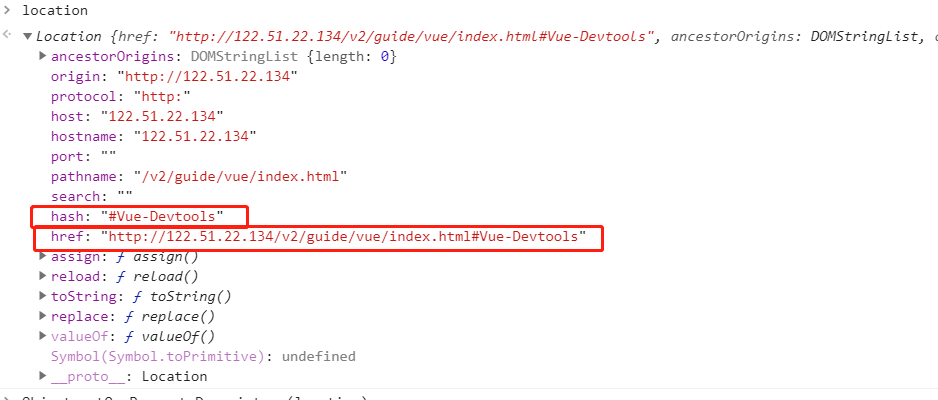
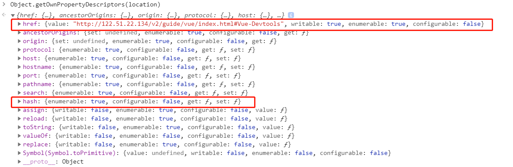
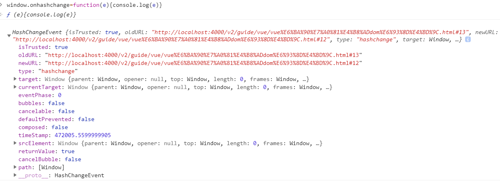
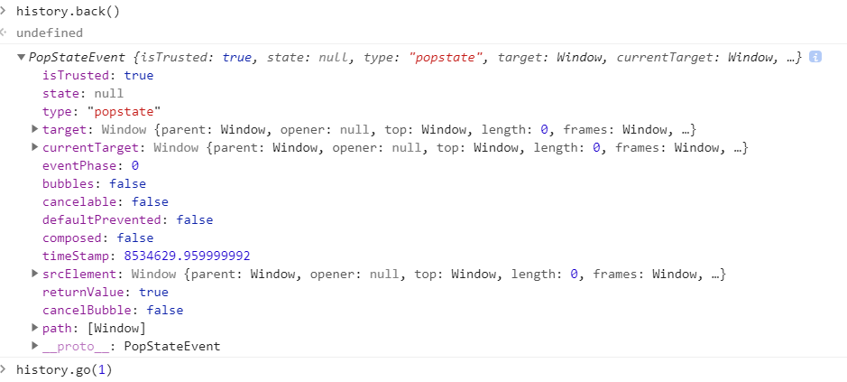

[TOC]
## location
在浏览器地址栏输入的路径是修改href或者hash

为什么不对href的hash进行拦截，用defineProperty定义get set方法？

因为location的herf和hash属性都是不配置的，不能对其进行defineProperty定义get set方法

## hash路由
当hash发生改变时会触发window.onhashchange方法调用，传入HashChangeEvent事件
`window.onhashchange=function(e){console.log(e)}`

## history路由
当在浏览器地址栏点击前进后退时会触发window.onpopstate方法调用，传入PopStateEvent事件
调用history.go(1) history.forward() history.back()都会触发onpopstate方法调用。

