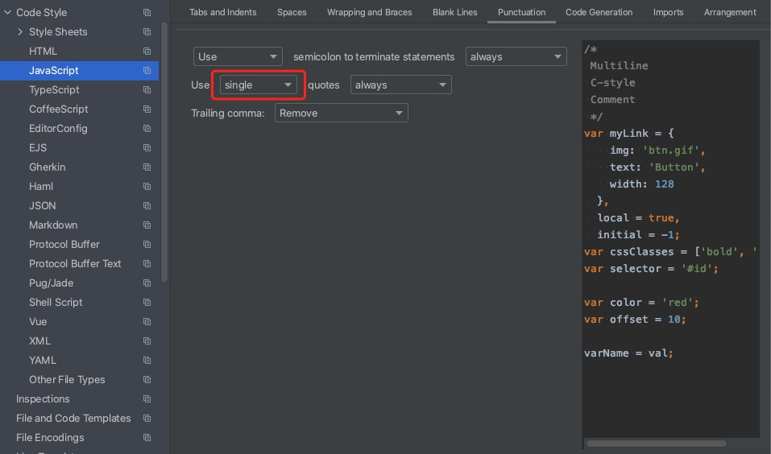

## 代码风格

## 设置webStorm代码风格


## editorConfig
- [文档](http://editorconfig.org)
- .editorconfig文件
```editorconfig
# http://editorconfig.org
root = true

# 说明
## 设置文件编码为 UTF-8；
## 用两个空格代替制表符；
## 在保存时删除尾部的空白字符；
## 在文件结尾添加一个空白行；
[*]
indent_style = space
indent_size = 2
end_of_line = lf
charset = utf-8
trim_trailing_whitespace = true
insert_final_newline = true

[*.md]
trim_trailing_whitespace = false

[Makefile]
indent_style = tab
```

## ESLint

## 配置规则

```
"rules": {
  "no-debugger": "off",
  "quotes": ["error", "double"]
},
```

rules配置  off/0 warn/1 error/2

- [文档](http://eslint.cn/)
- 有多个配置文件时的优先级
```
1 .eslintrc.js
2 .eslintrc.yaml
3 .eslintrc.yml
4 .eslintrc.json
5 .eslintrc
6 package.json
```
- .eslintrc.js


```js
module.exports = {
    parser: '@typescript-eslint/parser',
    plugins: ['react','@typescript-eslint'],
    rules: {
        // 禁止使用 var
        'no-var': "error",
        // 优先使用 interface 而不是 type
        '@typescript-eslint/consistent-type-definitions': [
            "error",
            "interface"
        ]
    }
}
```


## Prettier
-  [文档](https://prettier.io/)
- .prettierrc
```prettier
{
  // 设置强制单引号
  "singleQuote": true,
  // 为多行数组的非末尾行添加逗号 es5的对象，数组等
  "trailingComma": "es5",
  // 每行最大宽度 100
  "printWidth": 100,
  // 设置语句末尾不加分号
  "semi": false,
  // jsx中使用单引号
  "jsxSingleQuote": true,
}
```

## 参考
- [最强代码规范之-理解ESLint、Prettier、EditorConfig](https://mp.weixin.qq.com/s/A1nx4T1KcS6pjjgnWXwKig)
