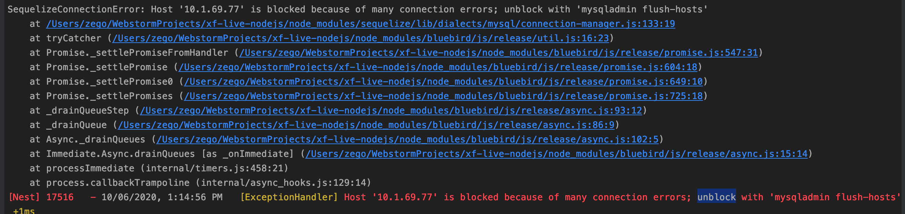

- 问题



- 解决方法

  -P 端口 -u用户名 -p密码

  `/usr/bin/mysqladmin flush-hosts -h192.168.xx.xx -P3306 -uroot -p123`


```mysql
show databases;
create database xf_live;
use xf_live;
source
```


## 参考

[cnblogs](https://www.cnblogs.com/susuyu/archive/2013/05/28/3104249.html)

