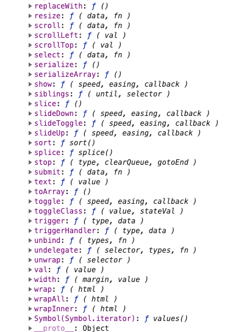
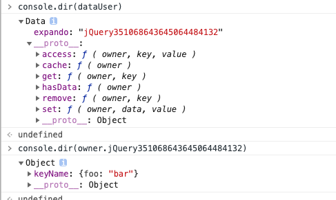

## jquery源码分析
## Jquery优点
- 小、快
- 支持css选择器查找元素以及样式属性操作
- 跨浏览器和可扩展
- 功能强大(dom 遍历、操作、事件处理、动画、ajax)
- 易于使用

## $( document ).ready(fn)的实现原理
1. 基于这几点实现
- document.readyState
- document.addEventListener( "DOMContentLoaded", completed );
- window.addEventListener( "load", completed );
2. DOMContentLoaded先触发 
3. window.onload 要等到所有image下载完成后触发
```js
//调试代码
$( document ).ready(function() {
    debugger
});

// The ready event handler and self cleanup method
function completed() {
    // 先卸载监听的事件回调函数，触发ready()方法
	document.removeEventListener( "DOMContentLoaded", completed );
	window.removeEventListener( "load", completed );
	jQuery.ready();
}

// Catch cases where $(document).ready() is called
// after the browser event has already occurred.
// Support: IE <=9 - 10 only
// Older IE sometimes signals "interactive" too soon
if ( document.readyState === "complete" ||
	( document.readyState !== "loading" && !document.documentElement.doScroll ) ) {

	// Handle it asynchronously to allow scripts the opportunity to delay ready
	window.setTimeout( jQuery.ready );

} else {
    //文档readState未完成时，注册回调函数
	// Use the handy event callback
	document.addEventListener( "DOMContentLoaded", completed );

	// A fallback to window.onload, that will always work
	window.addEventListener( "load", completed );
}
```
## Jquery对象都是数组
```js
//<div id="a">hello</div>
console.log($('#a'))
//
jQuery.fn.init = function( selector, context, root ) {
    // something
    if ( elem ) {
        // Inject the element directly into the jQuery object
        this[ 0 ] = elem;
        this.length = 1;
    }
    // this 是Jquery对象实例
    return this;
}

```



- jquery对象返回的是类数组
- $('#a')[0] 返回真实dom节点

## JQuery和$

```js
$('div').__proto__  === JQuery.prototype === JQuery.fn;

jQuery = function( selector, context ) {

    // The jQuery object is actually just the init constructor 'enhanced'
    // Need init if jQuery is called (just allow error to be thrown if not included)
    return new jQuery.fn.init( selector, context );
};

jQuery.fn = jQuery.prototype = {

	// The current version of jQuery being used
	jquery: version,

	constructor: jQuery,

	// The default length of a jQuery object is 0
	length: 0,

	toArray: function() {
		return slice.call( this );
	},
}
init = jQuery.fn.init = function( selector, context, root ) {
init.prototype = jQuery.fn;

window.jQuery = window.$ = jQuery
```
- $就是JQuery类
- $('div')调用JQuery构造函数，返回jquery对象
- $.fn === JQuery.prototype


## 数据服务
```js
//测试代码
$("#a").data("keyName", {foo: "bar"});
console.log($("#a").data("keyName"));// Returns { foo: "bar" }

//实现原理 this elem是元素节点
dataUser.set( this, key, value );
data = dataUser.get( elem, key );
```

- dataUser实现了数据的增删改查
- 数据存放在元素的节点上的私有属性上
## 
   
  
## 参考
- [jquery官网](https://jquery.com/)
- [jquery github](https://github.com/jquery/jquery.git)
